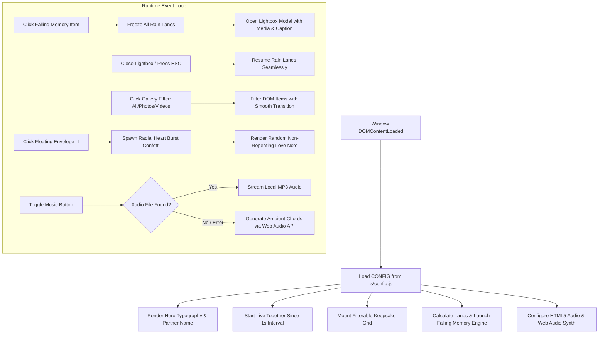

# "For You" — Interactive Surprise & Memory Keepsake Platform
### Complete System Architecture, Developer Guide & Implementation Manual

> **Project Reference:** `sp` / "For You" — Interactive Romantic Memory Web Application  
> **Target Technology Stack:** HTML5, CSS3 (Vanilla), JavaScript (ES6+ Vanilla)  
> **Build Requirements:** Zero dependencies, zero build steps, zero npm packages. Native browser execution.

---

## 📋 Table of Contents

1. [Executive Summary & Product Vision](#1-executive-summary--product-vision)
2. [Architecture & System Flow](#2-architecture--system-flow)
3. [Technology Stack & Constraints](#3-technology-stack--constraints)
4. [Project Directory & Workspace Layout](#4-project-directory--workspace-layout)
5. [Core Features & Functional Modules](#5-core-features--functional-modules)
   - [5.1 Continuous Falling Memory Rain (Multi-Lane Engine)](#51-continuous-falling-memory-rain-multi-lane-engine)
   - [5.2 Click-to-Freeze & High-Resolution Lightbox Modal](#52-click-to-freeze--high-resolution-lightbox-modal)
   - [5.3 Live "Together Since" Elapsed Counter](#53-live-together-since-elapsed-counter)
   - [5.4 Interactive Keepsake Gallery Grid with Multi-Filter](#54-interactive-keepsake-gallery-grid-with-multi-filter)
   - [5.5 Floating Parchment Love Notes & Radial Heart Burst Confetti](#55-floating-parchment-love-notes--radial-heart-burst-confetti)
   - [5.6 Dual-Mode Ambient Audio System (HTML5 Audio + Web Audio API Synth)](#56-dual-mode-ambient-audio-system-html5-audio--web-audio-api-synth)
   - [5.7 Accessibility & Mobile Responsiveness](#57-accessibility--mobile-responsiveness)
6. [Configuration Specification (`js/config.js`)](#6-configuration-specification-jsconfigjs)
7. [Step-by-Step Implementation & Developer Guide](#7-step-by-step-implementation--developer-guide)
8. [Visual Design System & Design Tokens](#8-visual-design-system--design-tokens)
9. [Deployment & Hosting Guide](#9-deployment--hosting-guide)
10. [Troubleshooting & Quality Assurance](#10-troubleshooting--quality-assurance)

---

## 1. Executive Summary & Product Vision

**"For You"** is an interactive, high-aesthetic single-page memory keepsake website designed to celebrate love, anniversaries, and personal milestones. Built strictly using pure **HTML5, CSS3, and modern Vanilla JavaScript**, the platform delivers a cinematic, emotionally resonant experience without requiring external frameworks, package managers, or server runtimes.

### Core Architectural Philosophy
- **Pure Web Triad (HTML, CSS, JS):** Total portability across any browser, operating system, or static web host. Runs immediately upon opening `index.html`.
- **Emotional Engagement & Interactivity:** Drifting memory polaroids simulate falling rain. A single tap instantaneously freezes physics across the viewport to isolate and savor a cherished moment.
- **Resilient Fallbacks:** Audio automatically adapts; if no local MP3 file exists, an internal Web Audio API algorithmic synthesizer crafts warm, ambient harmonic chords in real time.

```
   [ Personal Photos & Videos ] + [ Love Notes ] + [ Anniversary Date ]
                                      │
                                      ▼
                   ┌──────────────────────────────────────┐
                   │    "For You" Core Runtime Engine     │
                   │      (HTML5 + CSS3 + Vanilla JS)     │
                   └──────────────────────────────────────┘
                                      │
        ┌───────────────────┬─────────┴─────────┬───────────────────┐
        ▼                   ▼                   ▼                   ▼
 [Falling Rain]     [Live Counter]     [Keepsake Grid]     [Ambient Audio]
```

---

## 2. Architecture & System Flow

The application executes client-side as an event-driven Single Page Application (SPA).



---

## 3. Technology Stack & Constraints

| Layer | Technology | Role & Purpose |
|---|---|---|
| **Structure** | HTML5 Semantic Standard | Clean layout hierarchy (`<header>`, `<main>`, `<section>`, `<article>`, `<footer>`, `<dialog>`-like ARIA structures) |
| **Styling** | Vanilla CSS3 | Custom Properties (variables), luxury glassmorphism (`backdrop-filter`), CSS Grid, Flexbox, GPU-accelerated keyframe transforms |
| **Logic** | Vanilla JavaScript (ES6+) | Real-time interval calculations, DOM element recycling, touch/keyboard event listeners, Web Audio API synthesis |
| **Fonts** | Google Fonts CDN | *Playfair Display* (Editorial Serif), *Outfit* (Modern Sans), *Great Vibes* (Romantic Cursive) |
| **Dependencies** | **0 External Libraries** | No React, no Vue, no Tailwind, no npm, no Webpack/Vite. 100% native browser support. |

---

## 4. Project Directory & Workspace Layout

```
sp/
├── index.html                  # Master entry point and semantic structure
├── PROJECT_GUIDE.md            # Primary repository guide
├── just-for-here/
│   └── PROJECT_GUIDE (1).md    # Secondary reference guide copy
├── css/
│   └── style.css               # Luxury glassmorphic styling, animations, tokens
├── js/
│   ├── config.js               # User configuration: names, dates, notes, media
│   └── script.js               # Core application logic, rain engine, synth, modals
└── assets/
    ├── images/                 # Photo collection (image1.jpg - image13.jpg)
    ├── videos/                 # Video clips (vid1.mp4 - vid3.mp4)
    └── audio/                  # Background music (song.mp3 - optional)
```

---

## 5. Core Features & Functional Modules

### 5.1 Continuous Falling Memory Rain (Multi-Lane Engine)
- **100% Image Cycling:** Pulls and shuffles all 13 photos from `assets/images/` (`image1.jpg` - `image13.jpg`), ensuring every single memory falls smoothly in a continuous shower.
- **Zero Header-Freezing Physics:** Eliminates static DOM delays by spawning elements only when actively falling from `translateY(-260px)`, so cards never freeze or get trapped at `top: 0` in the header bar.
- **Dynamic Lane Allocation:** Viewport width determines lane count (4 lanes for mobile `<600px`, 6 for tablet `<1000px`, 7+ for desktop).
- **Negative Delay Pre-population:** Initial render uses negative animation offsets so photos are immediately floating mid-air across all heights when the page opens.
- **DOM Recycling & Seamless Flow:** Cards listen for `animationend` events, removing themselves from the DOM and scheduling the next staggered photo to maintain a perpetual, natural waterfall effect.

### 5.2 Click-to-Freeze & High-Resolution Lightbox Modal
- Clicking or tapping any falling card immediately adds the `.paused` CSS class to `#rain-container`, freezing CSS animations in place.
- Opens a luxury frosted glass modal displaying high-resolution media, full caption, and counter indicator (`X of Y`).
- Automatically handles video playback, muting background ambient tracks if desired, and pausing video playback when closed.
- Closing the modal (`✕` button, clicking backdrop, or pressing `Escape`) resumes all falling lanes from their exact mid-air coordinates.

### 5.3 Live "Together Since" Elapsed Counter
- Computes difference between current system time (`Date.now()`) and `CONFIG.sinceDate`.
- Formats and updates **Days**, **Hours**, **Minutes**, and **Seconds** in real time every `1000ms`.
- Padded with leading zeros for numerical symmetry within luxury glass container cards.

### 5.4 Interactive Keepsake Gallery Grid with Multi-Filter
- Responsive CSS Grid (`repeat(auto-fill, minmax(280px, 1fr))`).
- Category tabs: **All Moments**, **Photos**, **Videos**.
- Displays media badges (`📷 Photo`, `▶ Video`) and subtle hover-lift interactions with glow borders.
- Clicking any gallery item opens the unified lightbox modal at that exact item's index.

### 5.5 Floating Parchment Love Notes & Radial Heart Burst Confetti
- Fixed floating action button with ambient glowing pulse in the bottom-right corner.
- Tapping triggers a radial particle explosion of romantic emojis (`💖`, `💕`, `✨`, `🌹`, `🤍`, `🥰`) calculated via trigonometric dispersion (`cos(θ)`, `sin(θ)`).
- Opens an old-world parchment paper modal with wax seal aesthetic.
- Includes a "Next Note" generator with non-repeating random selection logic.

### 5.6 6-Track Romantic Soundtrack & Playlist System
- **6 Romantic Audio Tracks:** Fully integrated MP3 tracks located in `assets/audio/`:
  1. *Teka Lang* — EMMAN (Cover: `image1.jpg`)
  2. *Hirap Kalimutan* — Acoustic / Lyric (Cover: `image2.jpg`)
  3. *Ikaw at Ako* — Johnoy Danao (Cover: `image3.jpg`)
  4. *Libu-Libong Buwan (Uuwian)* — Kyle Raphael (Cover: `image4.jpg`)
  5. *Lalim* — MATÉO (Cover: `image5.jpg`)
  6. *Panaginip* — nicole (Cover: `image6.jpg`)
- **Automatic Playback & Auto-Advance:**
  - Even if no specific song is selected, the soundtrack automatically begins playing on the user's first interaction or when clicking the music button.
  - Automatically advances to the next track upon track completion so music plays continuously.
- **Interactive Playlist Modal & Glass Drawer:**
  - Displays all 6 songs with animated album cover art, glowing "Now Playing" badges, and animated equalizer bars.
  - Integrated playback scrubber with current time / duration, volume control slider, next/previous buttons, and vinyl disc rotation animation.
- **Algorithmic Fallback:** If any audio file is blocked or unavailable, the native **Web Audio API** `AudioContext` synthesizes a romantic 4-chord progression (`Cmaj9` → `Am9` → `Fmaj7` → `Gsus4`).

### 5.7 Accessibility & Mobile Responsiveness
- Full keyboard support: `Escape` closes active dialogs; `ArrowLeft` / `ArrowRight` navigate memories.
- `tabindex="0"` on cards and buttons for complete screen-reader compatibility.
- Automatic compliance with `prefers-reduced-motion`: pauses falling rain automatically if the user has motion sensitivities enabled in their OS.

---

## 6. Configuration Specification (`js/config.js`)

All customization is centralized within `js/config.js`:

```javascript
const CONFIG = {
  // 💖 Partner's Name (shown in hero & notes)
  partnerName: "My Love",

  // 🌹 Hero Headings & Subtitle
  heroTitlePrefix: "Forever & Always",
  heroSubtitle: "Falling deeper in love with you with every breath, every second, and every memory we share.",

  // ⏳ Start Date (Format: YYYY-MM-DD)
  sinceDate: "2023-02-14",

  // 🌧️ Rain Settings (Number of desktop lanes)
  rainLanes: 6,
  
  // 🎵 6-Track Romantic Playlist with Album Covers
  enableMusic: true,
  autoPlayOnFirstClick: true,
  defaultTrackIndex: 0,
  playlist: [
    {
      id: "track-1",
      title: "Teka Lang",
      artist: "EMMAN",
      src: "assets/audio/EMMAN - Teka Lang (Official Lyric Video).mp3",
      cover: "assets/images/image1.jpg"
    },
    {
      id: "track-2",
      title: "Hirap Kalimutan",
      artist: "Acoustic / Lyric",
      src: "assets/audio/Hirap Kalimutan (Official Lyric Video).mp3",
      cover: "assets/images/image2.jpg"
    },
    {
      id: "track-3",
      title: "Ikaw at Ako",
      artist: "Johnoy Danao",
      src: "assets/audio/Johnoy Danao - Ikaw at Ako (official music video).mp3",
      cover: "assets/images/image3.jpg"
    },
    {
      id: "track-4",
      title: "Libu-Libong Buwan (Uuwian)",
      artist: "Kyle Raphael",
      src: "assets/audio/Libu-Libong Buwan (Uuwian) - Kyle Raphael (Official Music Video).mp3",
      cover: "assets/images/image4.jpg"
    },
    {
      id: "track-5",
      title: "Lalim",
      artist: "MATÉO",
      src: "assets/audio/MATÉO - Lalim (Official Lyric Video with Chords).mp3",
      cover: "assets/images/image5.jpg"
    },
    {
      id: "track-6",
      title: "Panaginip",
      artist: "nicole",
      src: "assets/audio/Panaginip - nicole (Official Music Video) (1).mp3",
      cover: "assets/images/image6.jpg"
    }
  ],

  // 📸 Media Array (Images & Videos)
  media: [
    { type: "image", src: "assets/images/image1.jpg", caption: "Sweet smiles & endless sunshine" }
    // ...
  ]
};

window.CONFIG = CONFIG;
```

---

## 7. Step-by-Step Implementation & Developer Guide

### Step 1: Semantic Markup Assembly (`index.html`)
1. Create semantic landmarks: `<header>` with controls, `<main>` wrapping `#hero-section` and `#gallery-section`, plus floating modals and `<footer>`.
2. Link Google Fonts (`Playfair Display`, `Outfit`, `Great Vibes`) and `css/style.css` in `<head>`.
3. Load `js/config.js` first, followed by `js/script.js` before `</body>`.

### Step 2: Styling and Aesthetics Design (`css/style.css`)
1. Declare CSS Custom Properties for theme tokens (`--bg-deep`, `--accent-rose`, `--bg-card`, etc.).
2. Define glassmorphism utilities (`backdrop-filter: blur(16px)`, `border: 1px solid var(--border-glass)`).
3. Craft keyframe animations:
   - `@keyframes fallDown`: Controls vertical translation `translateY(-120px)` to `translateY(110vh)`.
   - `@keyframes floatOrb`: Ambient glow ball movement.
   - `@keyframes heartBurst`: Radial scatter and fade for confetti particles.
4. Establish media queries for responsive layouts (`@media (max-width: 768px)`).

### Step 3: Centralized Personalization (`js/config.js`)
1. Provide realistic defaults for `partnerName`, `sinceDate`, `media`, and `notes`.
2. Attach `CONFIG` directly to the `window` object for global access.

### Step 4: Core Interactive Logic (`js/script.js`)
1. Wrap logic in an IIFE to prevent namespace pollution.
2. Initialize the counter loop via `setInterval(updateCounter, 1000)`.
3. Construct the lane-based rain generator with randomized delays and rotation variables.
4. Wire modal open/close handlers with state flags to pause/resume animation classes.
5. Implement Web Audio API synthesis for seamless music fallback.

---

## 8. Visual Design System & Design Tokens

### Color Palette
- **Midnight Rose Background:** `#0a070e` / `#120c18`
- **Rose Accent:** `#ff758f`
- **Vibrant Rose:** `#ff4d6d`
- **Warm Champagne Gold:** `#f4c27f`
- **Deep Velvet Wine:** `#590d22`
- **Card Glass Surface:** `rgba(24, 16, 32, 0.72)`

### Typography Hierarchy
- **Hero Title & Display:** `Outfit` (Bold, Modern Sans) paired with `Great Vibes` (Fluid Romance Script)
- **Section Headers & Accents:** `Playfair Display` (Classic Editorial Serif)
- **Body & Captions:** `Outfit` (Clean, legible sans-serif at `16px` base)

---

## 9. Deployment & Hosting Guide

### Option 1: Direct File System (Zero Setup)
Double-click `index.html` from Windows File Explorer. The application will render immediately in Chrome, Edge, Firefox, or Safari.

### Option 2: Local HTTP Server
Run any lightweight static server:
```powershell
python -m http.server 8080
# Open http://localhost:8080 in your browser
```

### Option 3: GitHub Pages (Free Cloud Hosting)
1. Push the repository to GitHub:
   ```bash
   git init
   git add .
   git commit -m "Deploy For You surprise keepsake website"
   git branch -M main
   git remote add origin https://github.com/<username>/<repo-name>.git
   git push -u origin main
   ```
2. Navigate to **Settings** → **Pages** on your repository.
3. Select `Deploy from a branch` → `main` → `/ (root)` and click **Save**.
4. Your site will be live at `https://<username>.github.io/<repo-name>/`.

---

## 10. Troubleshooting & Quality Assurance

| Issue | Cause | Solution |
|---|---|---|
| **Audio doesn't play immediately** | Modern browser Autoplay Policies block unprompted audio | Click the **🎵 Music** button once to grant user interaction permission |
| **Images do not display** | File paths or names differ from `js/config.js` | Check `assets/images/` to verify filename and casing match `src` strings |
| **Together Counter shows 0** | Invalid date format in `js/config.js` | Use standard ISO `YYYY-MM-DD` (e.g., `"2023-02-14"`) |
| **Rain runs too quickly on mobile** | High refresh rates or narrow widths | Dynamic lane allocation automatically reduces lanes to 3 on mobile |
| **Rain causes distraction** | User prefers reduced motion | Click **"Freeze Rain"** or enable `prefers-reduced-motion` in OS settings |

---

*Authored for the `sp` Interactive Keepsake Project. Built strictly with HTML5, CSS3, and JavaScript.*
